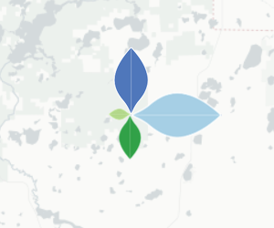
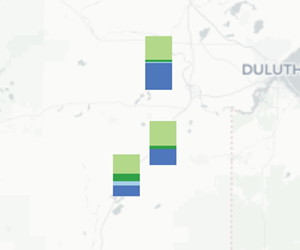
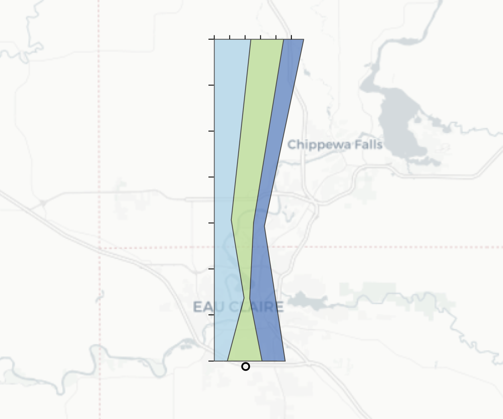

# Flyover Country Visualization Suite (FCVS)  

This repository contains the **Flyover Country Visualization Suite (FCVS)**, a multivariate visualization Javascript library currently built on [Leaflet](http://leafletjs.com/) for integration into the Flyover Country mobile app.

## What is Flyover Country?

[Flyover Country](https://flyovercountry.io/)  is a National Science Foundation funded offline mobile app for geoscience outreach and data discovery. The app exposes interactive geologic maps from Macrostrat.org, fossil localities from Neotomadb.org and Paleobiodb.org, core sample localities from LacCore.org, Wikipedia articles, offline base maps, and the user’s current GPS determined location, altitude, speed, and heading. The app analyzes a given flight path and caches relevant map data and points of interest (POI), and displays these data during the flight, without in flight wifi. By downloading only the data relevant to a particular flightpath, cache sizes remain reasonable, allowing for a robust experience without an internet connection.

The FCVS will be implemented into future versions of the app.

## Exploring Data with the FCVS

### What?

The FCVS utilizes the [Neotoma Database](https://www.neotomadb.org/) to bring vast multivariate, temporal paleoecological datasets into a concise mobile interface. Four specific taxa are set as the default, however, the user can pick any taxa to investigate. While currently set up to access a certain number of pollen taxa, the framework will be able to handle most data in the database. 

More information on the Neotoma database can be found [here](https://www.neotomadb.org/about/category/database).

### Where?

The user first defines an area on the map he or she wishes to explore. The latitude and longitude coordinates of the vertices are stored in WKT format and used to query the Neotoma API for data that lies within the defined polygon. 

Each visualization is attached to the coordinates of a site where the sample was collected. The SiteID, a number that act as the unique identifier for each site, can be retrieved by clicking/tapping on the icon.

### How?

The FCVS was deigned to visualize large multivariate datasets from the [Neotoma Database](https://www.neotomadb.org/). Addressing the problem of visualizing these data through a mobile cartographic interface, the suite includes four visualizations to explore Neotoma's pollen data:
* [Petal Plots](#petal-plot)
* [Stacked Bar Charts](#stacked-bar-chart)
* [Radar Charts](#radar-chart)
* [Flagpole Diagrams](#flagpole-diagram)

These visualizations were chosen after conducting a quantitative content analysis on all the visualizations from papers in the [Neotoma Citations Google Scholar page](https://scholar.google.com/citations?user=idoixqkAAAAJ&hl=en). The analysis provided insight into extant visualization methods in the field of paleoecology and informed selection of the particular examples included in the suite. The visualizations are created using [D3](https://github.com/d3/d3), the [Leaflet Data Visualization Framework](https://github.com/humangeo/leaflet-dvf), [Leaflet Rotated Markers](https://github.com/bbecquet/Leaflet.RotatedMarker), and native [Leaflet](http://leafletjs.com/) icon functions.

#### Petal Plot

A **petal plot** contains *n* custom icons rotated around a single location, where *n* is the number of variables in the data shown. The base of each icon located at the same latitude and longitude and each icon is rotated 360/*n* degrees. It uses color and size to encode nominal and numerical data, respectively. The orientation of each symbol also is used to encode the nominal value. Each color (in this example) is associated with a distinct taxon of pollen found at that site and is sized according to its value. The petal plot was not found in the analysis of the Neotoma citations, but is a novel technique for multivariate pollen visualization and suitable for mobile interfaces. 
 

#### Stacked Bar Chart

A **stacked bar chart** depicts proportionally sized bars on top of each other. The base of the stack is centered at the latitude and longitude of the site. It uses color and size to encode nominal and numerical data, respectively. Each bar is a separate icon attached to the site coordinates, but displaced vertically by the sum of the height of the previously drawn bars. Stacked bar charts were one of the most popular visualization techniques revealed in the Neotoma citation analysis and are also suitable for mobile interfaces.
 

#### Radar Chart

A **radar chart** (otherwise known as a star plot) has a polygon with *n* vertices along equi-angular axes, where *n* is the number of variables in the data shown. Each vertex and axis correspond to a single variable. The distance a particular vertex is displaced along the axis from the center of the chart is proportional to the value for that particular variable. Each chart is centered at the latitude and longitude of the site. The radar chart was not prevalent in the Neotoma citation analysis, but is another suitable multivariate visualization technique for mobile interfaces, as it can depict a lot of information in a concise space.

 
#### Flagpole Diagram

A **flagpole diagram** is a stacked area chart that is rotated 90 degrees, depicting time on the y-axis and value on the x-axis. The base of the graph is centered at the latitude and longitude of the site. It uses color and size to encode nominal and numerical data, respectively. Area charts of all kinds were quite popular in the Neotoma citation analysis. While flagpole diagrams are not entirely mobile-friendly, they allow for good comparison of multivariate data. The flagpole diagram is the purest temporal visualization included in the suite.

### When?

The samples in the database are not only spread across space, but as time as well. The data is binned by a defined time interval. The user can explore the timeline of the database through a slider bar. As the slider is shifted, the visualizations change according to the value of the preset taxa for that time period.

The petal plots, stacked bar charts, and radar charts are not inherently temporal visualizations. Interactivity via the sliding bar control allows for these visualizations to display information over time. The flagpole diagram, as mentioned, is the only inherently temporal visualization in the suite, displaying data across time without interactivity.

## Example

The following gif shows a possible interaction with the FCVS.

*GIF depicting possible interaction*
