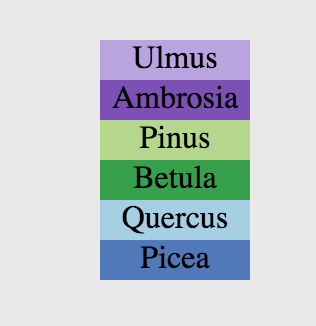
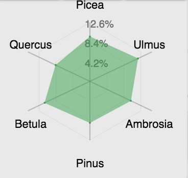
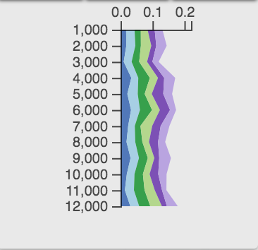

# Flyover Country Visualization Suite (FCVS)  

This repository contains the **Flyover Country Visualization Suite (FCVS)**, a multivariate visualization Javascript library currently built on [Leaflet](http://leafletjs.com/) and [D3](https://d3js.org/) for integration into the Flyover Country mobile app.

## What is Flyover Country?

[Flyover Country](https://flyovercountry.io/)  is a National Science Foundation funded offline mobile app for geoscience outreach and data discovery. The app exposes interactive geologic maps from Macrostrat.org, fossil localities from Neotomadb.org and Paleobiodb.org, core sample localities from LacCore.org, Wikipedia articles, offline base maps, and the user’s current GPS determined location, altitude, speed, and heading. The app analyzes a given flight path and caches relevant map data and points of interest (POI), and displays these data during the flight, without in flight wifi. By downloading only the data relevant to a particular flightpath, cache sizes remain reasonable, allowing for a robust experience without an internet connection.

## Exploring Data with the FCVS

### What?

The FCVS utilizes the [Neotoma Database](https://www.neotomadb.org/) to bring vast multivariate, temporal paleoecological datasets into a concise mobile interface. The interface offers a robust set of interactions, allowing users to  visualize 2-6 pollen taxa over space and time with four visualization types.

More information on the Neotoma database can be found [here](https://www.neotomadb.org/about/category/database).

### Where?
The library's code base includes methods for user-defined querying of the Neotoma database, including variable specification, geographical area of interest, and time period. Currently this functionality is not integrated into the interface, but was used to call the current dataset, which includes relative abundances of six pollen taxa in Minnesota over the past twelve millenia. 

### How?

 Addressing the problem of visualizing multivariate, spatiotemporal data through a mobile cartographic interface, the suite includes four visualizations to explore Neotoma's pollen data:
* [Petal Plots](#petal-plot)
* [Stacked Bar Charts](#stacked-bar-chart)
* [Radar Charts](#radar-chart)
* [Flagpole Diagrams](#flagpole-diagram)

These visualizations were chosen after conducting a quantitative content analysis on all the visualizations from papers in the [Neotoma Citations Google Scholar page](https://scholar.google.com/citations?user=idoixqkAAAAJ&hl=en). The analysis provided insight into extant visualization methods in the field of paleoecology and informed selection of the particular examples included in the suite. All the  visualizations were implemented using [D3](https://github.com/d3/d3), and [Leaflet](http://leafletjs.com/).

#### Petal Plot

A **petal plot** contains *n* custom icons rotated around a single location, where *n* is the number of variables in the data shown. The base of each icon located at the same latitude and longitude and each icon is rotated 360/*n* degrees. It uses color and size to encode nominal and numerical data, respectively. The orientation of each symbol also is used to encode the nominal value. Each color (in this example) is associated with a distinct taxon of pollen found at that site and is sized according to its value. The petal plot was not found in the analysis of the Neotoma citations, but is a novel technique for multivariate pollen visualization and suitable for mobile interfaces. 
 

#### Stacked Bar Chart

A **stacked bar chart** depicts proportionally sized bars on top of each other. The base of the stack is centered at the latitude and longitude of the site. It uses color and size to encode nominal and numerical data, respectively. Each bar is a separate icon attached to the site coordinates, but displaced vertically by the sum of the height of the previously drawn bars. Stacked bar charts were one of the most popular visualization techniques revealed in the Neotoma citation analysis and are also suitable for mobile interfaces.
 

#### Radar Chart

A **radar chart** (otherwise known as a star plot) has a polygon with *n* vertices along equi-angular axes, where *n* is the number of variables in the data shown. Each vertex and axis correspond to a single variable. The distance a particular vertex is displaced along the axis from the center of the chart is proportional to the value for that particular variable. Each chart is centered at the latitude and longitude of the site. The radar chart was not prevalent in the Neotoma citation analysis, but is another suitable multivariate visualization technique for mobile interfaces, as it can depict a lot of information in a concise space. The radar chart design is adapted from implementations by [Alvaro Graves](https://github.com/alangrafu/radar-chart-d3) and [Nadieh Bremer](https://gist.github.com/nbremer/6506614).

 
#### Flagpole Diagram

A **flagpole diagram** is a stacked area chart that is rotated 90 degrees, depicting time on the y-axis and value on the x-axis. The top of the graph is centered at the latitude and longitude of the site. It uses color and area to encode nominal and numerical data, respectively. Area charts of all kinds were quite popular in the Neotoma citation analysis. While flagpole diagrams are not entirely mobile-friendly, they allow for good comparison of multivariate data, and are the purest spatio-temporal visualization included in the suite.

### When?

Geoscientific data is temporal as well as spatial. FCVS bins data from the Neotoma database by a defined time interval. The user can explore the timeline of the database through a slider bar. As the slider is shifted, the visualizations change according to the value of the preset taxa for that time period.

The petal plots, stacked bar charts, and radar charts are not inherently temporal visualizations. Interactivity via the sliding bar control allows for these visualizations to display information over time. The flagpole diagram, as mentioned, is the only inherently temporal visualization in the suite, displaying data across time without interactivity.

## Flexible Interface

FCVS's interface allows users to choose between the four primary design types, and optimize the visualizations with several controls.

**Responsive Variable Display:** All of the visualization types support visualization of 2-6 user defined variables. The default is four.

**Symbol Size:** Depending on the area of interest, users may optimize readability by toggling the symbol size.

**Site Markers:** Users may toggle site markers on and off. The default is to display site markers because symbol anchors vary by visualization type.

**Axes:** Radar and flagpole chart designs include axes to aid with comparison, but may be toggled on and off.
